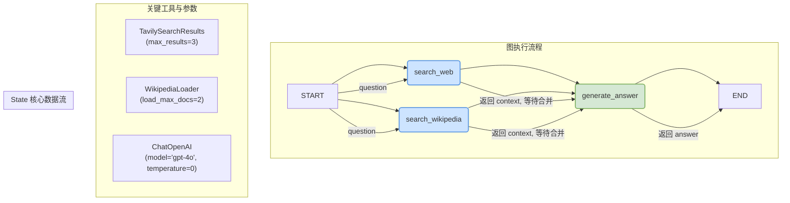

# LangGraph 教程：并行执行 (Parallelization)

欢迎来到 LangGraph 的并行执行教程！在本教程中，我们将学习如何构建一个图 (Graph)，使其能够同时从多个数据源（网络搜索和维基百科）获取信息，然后将这些信息汇总，以生成一个全面的答案。

这个例子清晰地展示了 LangGraph 中一个强大的特性：**并行化 (Parallelization)**，也常被称为“扇出/扇入 (Fan-out/Fan-in)”模式。

**你将学到:**

*   如何定义一个健壮的、支持并发更新的状态 (State)。
*   `TypedDict` 和 `Annotated` 在 LangGraph 中的核心作用。
*   如何将普通 Python 函数封装成图中的节点 (Node)。
*   如何设置从 `START` 节点分叉的并行执行路径 (Fan-out)。
*   LangGraph 如何自动等待并行任务完成，并将结果汇集到下一个节点 (Fan-in)。
*   使用 Mermaid 图表来理解和可视化你的图结构。

---

## 1. 核心概念与准备工作

在构建图之前，我们首先需要理解构成图的几个核心组件：状态（State）、工具（Tools）和节点（Nodes）。

### 1.1. 项目依赖

首先，我们需要导入所有必要的库。这些库各司其职，共同构成了我们应用的基础。

```python
# 导入 'operator' 模块, 它提供了一套与Python内部操作符对应的函数。
# 在这里, 我们将使用 operator.add 来合并列表, 这是 LangGraph 中实现状态更新的一种常见模式。
import operator
# 导入 'Annotated' 类型, 它允许我们向类型提示中添加上下文相关的元数据。
# 在 LangGraph 中, 它与 operator.add 结合使用, 用于指定状态字段的更新方式。
# 导入 'TypedDict'，它用于创建具有固定键和特定值类型的字典，可以提供静态类型检查。
from typing import Annotated
from typing_extensions import TypedDict

# 从 langchain_core 中导入 'Document' 类, 用于表示从数据源加载的文档。
from langchain_core.documents import Document
# 从 langchain_core 中导入消息类型 'HumanMessage' 和 'SystemMessage', 用于与语言模型进行交互。
from langchain_core.messages import HumanMessage, SystemMessage

# 从 langchain_community 中导入 'WikipediaLoader', 这是一个用于从维基百科加载文档的工具。
from langchain_community.document_loaders import WikipediaLoader
# 从 langchain_community 中导入 'TavilySearchResults', 这是一个进行网络搜索的工具。
from langchain_community.tools import TavilySearchResults

# 从 langchain_openai 中导入 'ChatOpenAI', 这是与 OpenAI 的聊天模型 (如 GPT-4o) 进行交互的接口。
from langchain_openai import ChatOpenAI

# 从 langgraph.graph 中导入 'StateGraph', 'START', 'END'。
# 'StateGraph' 是构建状态图的核心类。
# 'START' 和 'END' 是特殊的节点, 分别代表图的入口和出口。
from langgraph.graph import StateGraph, START, END
```

### 1.2. 定义图的状态 (State)

状态 (State) 是 LangGraph 的核心。它是一个在图的整个执行过程中持续存在并被修改的数据结构。一个设计良好的状态对象是构建复杂应用的关键。

我们使用 `TypedDict` 来定义状态的结构。

```python
class State(TypedDict):
    """
    定义图的状态。这个 TypedDict 描述了在图的执行过程中需要跟踪的所有数据。
    每个键代表状态的一个字段。
    """
    # 'question': 用户的原始问题, 类型为字符串。
    question: str
    # 'answer': 由 LLM 生成的最终答案, 类型为字符串。
    answer: str
    # 'context': 从各个来源 (网络搜索、维基百科) 收集到的上下文信息。
    context: Annotated[list, operator.add]
```

#### 深入解析 `TypedDict`

`TypedDict` (类型化字典) 是一个强大的工具，用于为字典提供类型提示，从而增强代码的可读性和健壮性。

*   **核心特性**:
    1.  **静态类型检查 (在编程阶段)**:
        *   "静态分析"阶段就是指**编程阶段**，而不是程序（例如 LangGraph 应用）部署后的**运行阶段**。
        *   当您在 VS Code (借助 Pylance/Pyright) 或使用 `mypy` 等工具编写和检查代码时，`TypedDict` 会帮助检查：
            *   字典是否包含了所有必需的键。
            *   每个键对应的值是否是正确的类型。
            *   是否有拼写错误的键名。
        *   这可以在代码运行前就发现潜在的 bug。
    2.  **运行时等效性 (在运行阶段)**:
        *   一旦程序开始执行 (`python your_script.py`), `TypedDict` 定义的类型在功能上就和一个普通的 `dict` 完全相同。
        *   Python 解释器在运行时不会检查键是否存在或类型是否正确。
    3.  **键的强制性 (Totality)**:
        *   默认 (`total=True`) 所有定义的键都必须存在。
        *   可以通过设置 `total=False` 使所有键变为可选，或使用 `typing.Required` 和 `typing.NotRequired` (Python 3.11+) 进行精细控制。

在 LangGraph 中, `TypedDict` 被用作定义图状态 (State) 的标准方式。这提供了一个清晰、类型安全的“契约”，规定了在整个图的生命周期中数据应该如何组织。

#### 深入解析 `Annotated`

**Q: 为什么 `context` 字段用 `Annotated[list, operator.add]` 而不是直接用 `list`?**

**A: 为了解决并行节点更新同一个状态字段时的数据覆盖问题。**

1.  **如果只用 `context: list`**:
    *   当 `search_web` 和 `search_wikipedia` 并行运行时，它们都会尝试更新 `context`。
    *   如果 `search_web` 先完成, 它返回 `{'context': ['web的结果']}`。此时状态 `context` 变为 `['web的结果']`。
    *   然后 `search_wikipedia` 完成, 它返回 `{'context': ['wiki的结果']}`。此时状态 `context` 会被**覆盖**成 `['wiki的结果']`。
    *   最终, `search_web` 的结果就丢失了。

2.  **`Annotated` 的作用**:
    *   `Annotated` 允许我们给一个类型 (如 `list`) 附加额外的元数据 (metadata)。
    *   这些元数据对普通的 Python 代码和类型检查器是透明的, 但特定的框架 (如 LangGraph) 可以读取并利用它们。

3.  **`Annotated[list, operator.add]` 的含义**:
    *   `list`: 这是基础类型, 明确 `context` 是一个列表。
    *   `operator.add`: 这是附加的元数据, 在 LangGraph 中它被解释为一个 **"reducer" (聚合器) 函数**。

    这行代码等于在告诉 LangGraph:
    > "`context` 是一个列表。当有多个节点同时要更新它时, 不要相互覆盖, 而是使用 `operator.add` 函数 (即列表的 `+` 操作) 将所有返回的列表**合并**在一起。"

    因此, `['web的结果']` 和 `['wiki的结果']` 会被正确地合并为 `['web的结果', 'wiki的结果']`。

### 1.3. 初始化工具 (Tools)

我们的图需要一些工具来与外部世界交互。

*   **语言模型 (LLM)**: 用于最终生成答案。
*   **搜索工具**: 用于从不同来源获取信息。

```python
# 初始化语言模型
# model="gpt-4o": 指定使用的模型。这是OpenAI最新、能力最强的模型之一。
# temperature=0: 设置温度为0, 表示模型的输出将更具确定性, 减少随机性。这在需要可复现、基于事实的回答时非常有用。
llm = ChatOpenAI(model="gpt-4o", temperature=0)

# 初始化 Tavily 搜索工具, 在 search_web 节点中使用
# max_results=3: 表示每次搜索最多返回3个结果。可以根据需要调整。
tavily_search = TavilySearchResults(max_results=3)

# 初始化维基百科加载器, 在 search_wikipedia 节点中使用
# query: 将在节点内根据当前问题动态设置。
# load_max_docs=2: 每次查询最多加载2篇相关的维基百科文章。
# doc_content_chars_max=1000: (可选) 可以通过这个参数限制每篇文章的字符数，避免上下文过长。
# lang="zh": (可选) 可以指定搜索的维基百科语言，默认为英文 "en"。
wikipedia_loader = WikipediaLoader
```

---

## 2. 构建图的节点 (Nodes)

节点是图中的基本计算单元。在 LangGraph 中，任何一个 Python 函数都可以成为一个节点，只要它遵循特定的输入输出规范。

### 深度解析：LangGraph 节点

*   **函数签名**: `def a_node_function(state: State) -> dict:`
    *   `state: State`: 节点的第一个参数**总是**图的当前状态。节点可以从中读取所需数据。
    *   `-> dict`: 节点**必须**返回一个字典。这个字典的键必须是 `State` 中定义的键。LangGraph 会用这个字典来更新对应的状态字段。

*   **高级功能**:
    *   **运行时配置**: 节点可以接受第二个可选参数 `config: RunnableConfig`，从而在运行时动态调整行为 (例如，传入 `user_id`)。
    *   **流式输出**: 节点可以通过 `get_stream_writer()` 实时返回中间数据，而无需等待整个节点执行完毕。
    *   **错误处理**: `ToolNode` 等预构建节点支持 `handle_tool_errors` 参数，可以精细控制异常处理行为。
    *   **中断与人工介入**: 可以在图的任何节点前后设置断点 (`interrupt_before`/`interrupt_after`)，暂停图的执行以进行人工审核或修改。

### 节点 1: `search_web`

这个节点负责使用 Tavily 工具进行网络搜索。

```python
def search_web(state: State) -> dict:
    """
    一个图节点: 从网络上检索文档。
    
    参数:
        state (State): 当前图的状态, 包含 'question' 字段。
        
    返回:
        dict: 一个字典, 其中 'context' 键包含从网络搜索中找到的格式化文档。
    """
    print("---节点: search_web---")
    tavily_search = TavilySearchResults(max_results=3)
    search_docs = tavily_search.invoke(state['question'])
    
    formatted_search_docs = "\n\n---\n\n".join(
        [
            f'<Document href="{doc["url"]}"/>\n{doc["content"]}\n</Document>'
            for doc in search_docs
        ]
    )
    
    # 返回一个字典来更新状态。'context' 字段将被添加上新的搜索结果。
    return {"context": [formatted_search_docs]}
```

### 节点 2: `search_wikipedia`

这个节点负责使用 `WikipediaLoader` 从维基百科搜索信息。

```python
def search_wikipedia(state: State) -> dict:
    """
    一个图节点: 从维基百科检索文档。
    
    参数:
        state (State): 当前图的状态, 包含 'question' 字段。
        
    返回:
        dict: 一个字典, 其中 'context' 键包含从维基百科中找到的格式化文档。
    """
    print("---节点: search_wikipedia---")
    search_docs = WikipediaLoader(query=state['question'], 
                                  load_max_docs=2).load()
    
    formatted_search_docs = "\n\n---\n\n".join(
        [
            f'<Document source="{doc.metadata["source"]}" page="{doc.metadata.get("page", "")}"/>\n{doc.page_content}\n</Document>'
            for doc in search_docs
        ]
    )
    
    # 返回一个字典来更新状态。
    return {"context": [formatted_search_docs]}
```

### 节点 3: `generate_answer`

这个节点是“扇入”点。它会等待 `search_web` 和 `search_wikipedia` 都完成后执行。它读取合并后的 `context`，并调用 LLM 生成最终答案。

```python
def generate_answer(state: State) -> dict:
    """
    一个图节点: 根据收集到的上下文生成答案。
    
    参数:
        state (State): 当前图的状态, 包含 'question' 和 'context' 字段。
        
    返回:
        dict: 一个字典, 其中 'answer' 键包含由 LLM 生成的答案对象。
    """
    print("---节点: generate_answer---")
    context = state["context"]
    question = state["question"]
    
    answer_template = """使用以下上下文来回答问题: {question}
上下文: 
{context}
"""
    answer_instructions = answer_template.format(question=question, 
                                                 context=context)    
    
    answer = llm.invoke([SystemMessage(content=answer_instructions),
                         HumanMessage(content=f"请回答这个问题。")])
      
    # 返回一个字典来更新状态中的 'answer' 字段。
    return {"answer": answer}
```

---

## 3. 定义并可视化图 (Graph)

现在我们有了状态定义和所有节点，是时候将它们组装成一个完整的图了。

### 3.1. 图的构建步骤

1.  **初始化 `StateGraph`**: 我们传入 `State` 类, 这样 `StateGraph` 就知道了图的状态结构。
2.  **添加节点 (`add_node`)**: 为每个函数（计算单元）分配一个唯一的名称。
3.  **添加边 (`add_edge`)**: 定义节点之间的执行顺序。

```python
# 1. 初始化 StateGraph
builder = StateGraph(State)

# 2. 添加节点 (Nodes)
builder.add_node("search_web", search_web)
builder.add_node("search_wikipedia", search_wikipedia)
builder.add_node("generate_answer", generate_answer)

# 3. 添加边 (Edges)
# 从 START 开始, 并行执行 "search_wikipedia" 和 "search_web"。
# 这就是所谓的“扇出”(fan-out)。
builder.add_edge(START, "search_wikipedia")
builder.add_edge(START, "search_web")

# "search_wikipedia" 和 "search_web" 都执行完毕后, 将它们的结果汇集到 "generate_answer" 节点。
# 这就是所谓的“扇入”(fan-in)。
# LangGraph 会自动等待这两个并行节点都完成后, 再执行 "generate_answer"。
builder.add_edge("search_wikipedia", "generate_answer")
builder.add_edge("search_web", "generate_answer")

# "generate_answer" 节点执行完毕后, 流程结束 (END)。
builder.add_edge("generate_answer", END)

# 4. 编译图
# `compile()` 方法将我们定义的节点和边组合成一个可执行的图对象。
graph = builder.compile()
```

### 3.2. 使用 Mermaid 可视化图

理解图的结构最直观的方式就是将其可视化。LangGraph 支持直接生成 Mermaid 语法的图表。



**图解:**
1.  **扇出 (Fan-out)**: 流程从 `START` 开始，同时流向 `search_web` 和 `search_wikipedia` 两个节点。这两个节点会并行执行，互不干扰。
2.  **扇入 (Fan-in)**: `generate_answer` 节点是这两个并行分支的汇合点。LangGraph 会智能地等待，直到 `search_web` 和 `search_wikipedia` **全部**执行完毕，并且它们返回的 `context` 已经通过 `operator.add` 合并到主状态中后，才会开始执行 `generate_answer`。
3.  **结束**: `generate_answer` 执行完毕后，将结果写入状态，然后流程到达 `END`，整个图执行完毕。

---

## 4. 执行图并查看结果

最后一步是调用我们编译好的图。

`if __name__ == "__main__":` 是 Python 的一个常用模式。这段代码块里的内容只有在直接运行这个 `.py` 文件时才会执行, 如果这个文件被其他文件作为模块导入, 则不会执行。这使得我们可以方便地为模块添加测试或演示代码。

```python
if __name__ == "__main__":
    # 定义一个问题
    question = "谷歌2025年第二季度的财报表现如何?"
    
    print(f"问题: {question}\n")
    
    # 使用 `invoke` 方法来执行图。
    # 我们需要提供一个符合 `State` 结构的初始状态字典。
    # 这里我们只提供了 'question', 其他字段将在图的执行过程中被填充。
    result = graph.invoke({"question": question})
    
    print("\n---最终结果---")
    # `result` 是最终的状态字典。
    # `result['answer']` 是一个 AIMessage 对象, 我们需要访问它的 `.content` 属性来获取字符串形式的答案。
    print(f"答案: {result['answer'].content}")
    
    print("\n---收集的上下文---")
    # 打印收集到的所有上下文信息
    for i, ctx in enumerate(result['context']):
        print(f"上下文 {i+1}:\n{ctx}\n")
```

**执行分析:**
1.  `graph.invoke({"question": ...})`: 我们用一个包含初始问题的字典来启动图。
2.  图开始执行，`search_web` 和 `search_wikipedia` 节点并行运行。你会在控制台看到它们的 `print` 语句交错出现。
3.  两个搜索节点完成后，`generate_answer` 节点开始运行。
4.  `invoke` 方法返回最终的 `State` 字典，其中包含了所有被填充的字段（`question`, `context`, `answer`）。
5.  我们从返回结果中提取并打印出答案和收集到的所有上下文信息。

---

## 5. 完整代码参考

```python
# 导入 'operator' 模块, 它提供了一套与Python内部操作符对应的函数。
# 在这里, 我们将使用 operator.add 来合并列表, 这是 LangGraph 中实现状态更新的一种常见模式。
import operator
# 导入 'Annotated' 类型, 它允许我们向类型提示中添加上下文相关的元数据。
# 在 LangGraph 中, 它与 operator.add 结合使用, 用于指定状态字段的更新方式。
# 导入 'TypedDict'，它用于创建具有固定键和特定值类型的字典，可以提供静态类型检查。
from typing import Annotated
from typing_extensions import TypedDict

# 从 langchain_core 中导入 'Document' 类, 用于表示从数据源加载的文档。
from langchain_core.documents import Document
# 从 langchain_core 中导入消息类型 'HumanMessage' 和 'SystemMessage', 用于与语言模型进行交互。
from langchain_core.messages import HumanMessage, SystemMessage

# 从 langchain_community 中导入 'WikipediaLoader', 这是一个用于从维基百科加载文档的工具。
from langchain_community.document_loaders import WikipediaLoader
# 从 langchain_community 中导入 'TavilySearchResults', 这是一个进行网络搜索的工具。
from langchain_community.tools import TavilySearchResults

# 从 langchain_openai 中导入 'ChatOpenAI', 这是与 OpenAI 的聊天模型 (如 GPT-4o) 进行交互的接口。
from langchain_openai import ChatOpenAI

# 从 langgraph.graph 中导入 'StateGraph', 'START', 'END'。
# 'StateGraph' 是构建状态图的核心类。
# 'START' 和 'END' 是特殊的节点, 分别代表图的入口和出口。
from langgraph.graph import StateGraph, START, END

# 初始化语言模型
# model="gpt-4o": 指定使用的模型。
# temperature=0: 设置温度为0, 表示模型的输出将更具确定性, 减少随机性。
llm = ChatOpenAI(model="gpt-4o", temperature=0)

class State(TypedDict):
    """
    定义图的状态。这个 TypedDict 描述了在图的执行过程中需要跟踪的所有数据。
    每个键代表状态的一个字段。
    """
    # 'question': 用户的原始问题, 类型为字符串。
    question: str
    # 'answer': 由 LLM 生成的最终答案, 类型为字符串。
    answer: str
    # 'context': 从各个来源 (网络搜索、维基百科) 收集到的上下文信息。
    # 使用 Annotated[list, operator.add] 告诉 LangGraph 当多个节点更新 context 时,
    # 应该将它们的列表结果合并, 而不是相互覆盖。
    context: Annotated[list, operator.add]

def search_web(state: State) -> dict:
    """
    一个图节点: 从网络上检索文档。
    """
    print("---节点: search_web---")
    tavily_search = TavilySearchResults(max_results=3)
    search_docs = tavily_search.invoke(state['question'])
    
    formatted_search_docs = "\n\n---\n\n".join(
        [
            f'<Document href="{doc["url"]}"/>\n{doc["content"]}\n</Document>'
            for doc in search_docs
        ]
    )
    
    return {"context": [formatted_search_docs]}

def search_wikipedia(state: State) -> dict:
    """
    一个图节点: 从维基百科检索文档。
    """
    print("---节点: search_wikipedia---")
    search_docs = WikipediaLoader(query=state['question'], 
                                  load_max_docs=2).load()
    
    formatted_search_docs = "\n\n---\n\n".join(
        [
            f'<Document source="{doc.metadata["source"]}" page="{doc.metadata.get("page", "")}"/>\n{doc.page_content}\n</Document>'
            for doc in search_docs
        ]
    )
    
    return {"context": [formatted_search_docs]}

def generate_answer(state: State) -> dict:
    """
    一个图节点: 根据收集到的上下文生成答案。
    """
    print("---节点: generate_answer---")
    context = state["context"]
    question = state["question"]
    
    answer_template = """使用以下上下文来回答问题: {question}
上下文: 
{context}
"""
    answer_instructions = answer_template.format(question=question, 
                                                 context=context)    
    
    answer = llm.invoke([SystemMessage(content=answer_instructions),
                         HumanMessage(content=f"请回答这个问题。")])
      
    return {"answer": answer}

# --- 图的构建 ---
builder = StateGraph(State)

builder.add_node("search_web", search_web)
builder.add_node("search_wikipedia", search_wikipedia)
builder.add_node("generate_answer", generate_answer)

builder.add_edge(START, "search_wikipedia")
builder.add_edge(START, "search_web")

builder.add_edge("search_wikipedia", "generate_answer")
builder.add_edge("search_web", "generate_answer")

builder.add_edge("generate_answer", END)

graph = builder.compile()

# --- 启动测试案例 ---
if __name__ == "__main__":
    question = "谷歌2025年第二季度的财报表现如何?"
    
    print(f"问题: {question}\n")
    
    result = graph.invoke({"question": question})
    
    print("\n---最终结果---")
    print(f"答案: {result['answer'].content}")
    
    print("\n---收集的上下文---")
    for i, ctx in enumerate(result['context']):
        print(f"上下文 {i+1}:\n{ctx}\n")